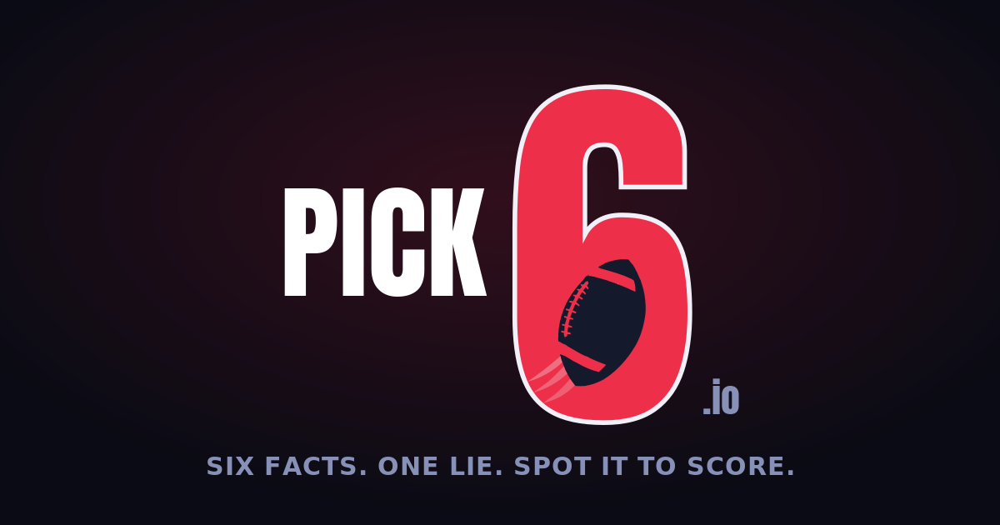
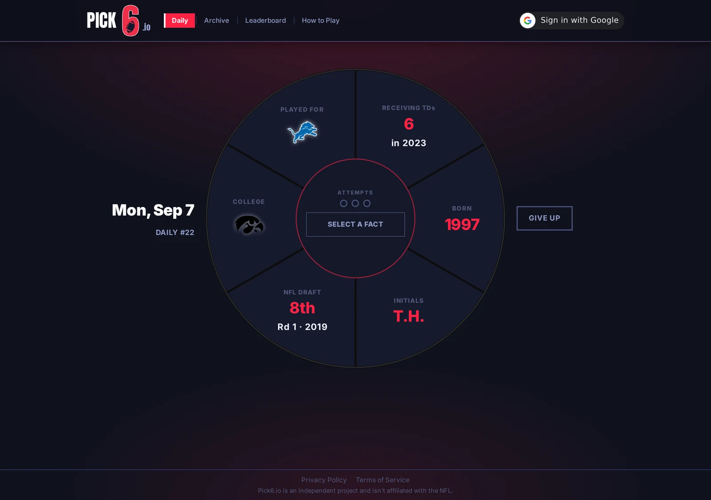
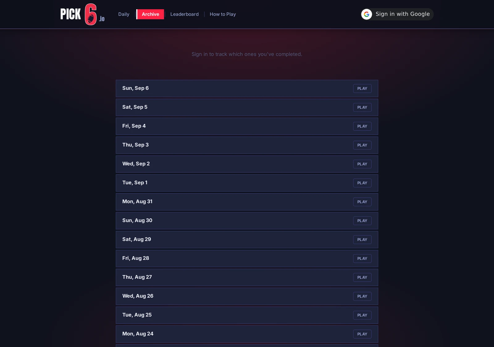
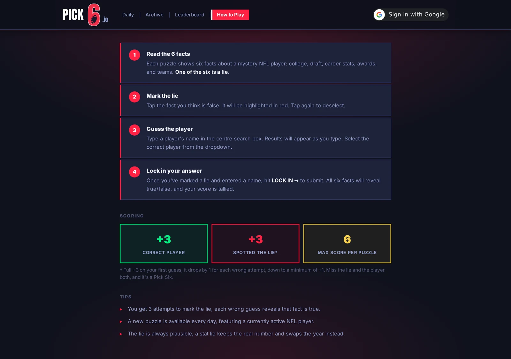

# Pick6.io

A daily NFL trivia puzzle game. Each puzzle shows six facts about a mystery player, however one of them is a lie. Spot the lie, name the player, and score points. Whiff on both and it's a Pick Six.



## Screenshots

<table>
<tr>
<td width="33%"></td>
<td width="33%"></td>
<td width="33%"></td>
</tr>
</table>

## How it works

- One puzzle per day, featuring a currently active NFL player
- **+3 pts** for naming the correct player · **+3 pts** for spotting the lie (drops by 1 per wrong attempt, min +1)
- Max score: **6 points** · miss both and it's a Pick Six
- Missed a day? Past puzzles stay playable in the archive
- Sign in with Google to save your results across devices and appear on the leaderboard

Facts are generated from a player's real record, so the lie has to sit convincingly among them:

| Group | Facts |
|-------|-------|
| Profile | College, draft round/pick/year, jersey number, birth year, initials, teams played for |
| Career stats | Passing yards & TDs, rushing yards, receiving yards & TDs, sacks, interceptions |
| Accolades | Super Bowls, Pro Bowls, All-Pro, MVP, Heisman, Hall of Fame, OROY/DROY/OPOY/DPOY/CPOY |

Each lie is a plausible near miss rather than a wild one. A stat lie keeps the real number and swaps the season, a draft lie nudges the round or year, and an initials lie borrows the initials of a real player at the same position.

## Tech stack

| Layer | Technology |
|-------|-----------|
| Frontend | React + Vite |
| API | Node.js / Express |
| Database | PostgreSQL (AWS RDS) |
| Auth | Google Sign-In, JWT session cookie |
| Awards data | `public/awards.csv` — scraped from Wikipedia |
| Deployment | Vercel (frontend) · Render (API) |

Answers are withheld server-side: the player's name, the lie, and the reveal portrait are stripped from every response until they've been earned.

## Project structure

```
├── src/                  # React frontend
│   ├── components/       # GameBoard, Header, HowToPlay, Archive, Leaderboard, Admin, ...
│   ├── utils/            # factDisplay, teamLogo, collegeLogo
│   └── App.jsx
├── api/                  # Express API server
│   ├── index.js          # Routes + security middleware
│   ├── auth.js           # Google sign-in, sessions, admin gate
│   └── puzzle.js         # Puzzle generation logic
├── public/
│   ├── awards.csv        # HOF, Pro Bowl, All-Pro, MVP, OPOY, DPOY, ROY, CPOY (1957–2025)
│   ├── logos/            # NFL team + college logos
│   └── og-image.png      # Social share preview image
├── docs/
│   └── screenshots/      # README screenshots
├── scripts/              # Data loading + scraping scripts (Python)
├── render.yaml           # Render deployment config (API)
└── vercel.json           # Vercel deployment config (frontend)
```
